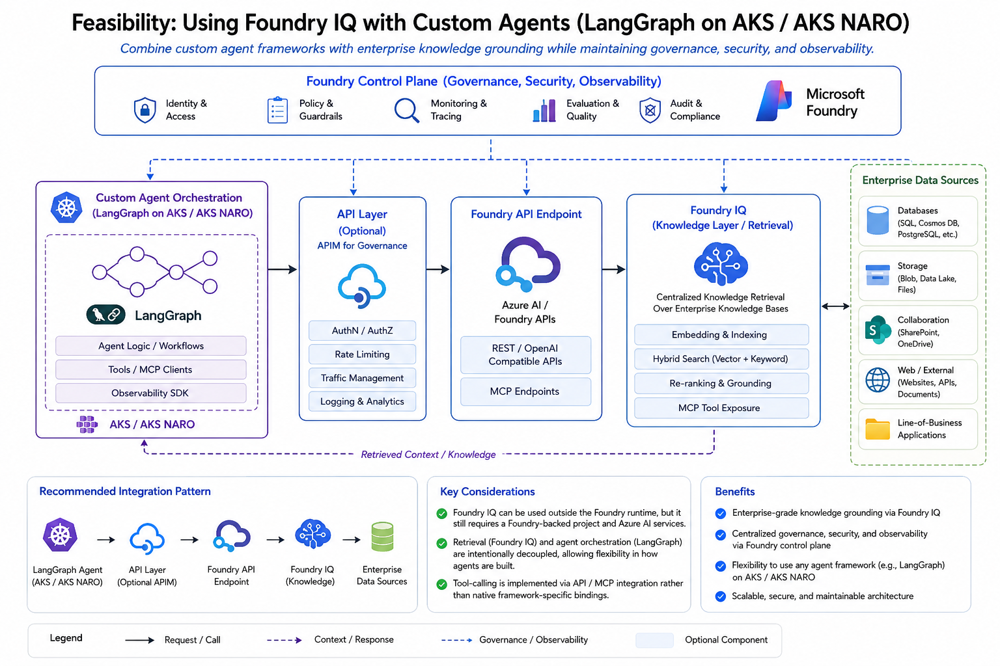

# LangGraph × Foundry IQ

> Custom **LangGraph** agent (Python + FastAPI on AKS) that uses **Microsoft Foundry IQ** as its enterprise knowledge layer, with all traffic flowing through **Azure API Management as an AI Gateway** inside a private VNET. The front-end is an **Ionic + Angular** SPA that adapts its layout for **mobile, iPad, and desktop**.



---

## Table of Contents

- [Project description](#project-description)
- [Architecture](#architecture)
  - [Flow](#flow)
  - [Components](#components)
- [Azure resources used in this POC](#azure-resources-used-in-this-poc)
- [Folder structure](#folder-structure)
- [Quick start (local dev)](#quick-start-local-dev)
  - [1. Backend API](#1-backend-api)
  - [2. Front-end UI](#2-front-end-ui)
- [Deploying to AKS](#deploying-to-aks)
  - [Build & push images](#build--push-images)
  - [Apply Kubernetes manifests](#apply-kubernetes-manifests)
- [APIM AI Gateway setup](#apim-ai-gateway-setup)
- [Sample prompts (built into the UI)](#sample-prompts-built-into-the-ui)
- [Responsive UI design](#responsive-ui-design)
- [Security model](#security-model)
- [Extending the LangGraph](#extending-the-langgraph)
- [About](#about)

---

## Project description

This repository is a working **feasibility implementation** of the pattern in `Architecture.png`:
**“Using Foundry IQ with Custom Agents (LangGraph on AKS / AKS NARO).”**

It demonstrates how an enterprise can:

- keep agent orchestration in an open framework (**LangGraph**),
- still use **Foundry IQ** for centralized, governed knowledge retrieval over an Azure AI Search index (`sp-search-index`, hooked into a SharePoint data source),
- expose the Foundry agent (`sp-search`) over an **APIM AI Gateway** that lives inside a private VNET with **private endpoints**, giving you AuthN/AuthZ, rate limiting, semantic caching, content safety, and observability — without the LangGraph service ever holding Foundry credentials,
- and ship a polished **Ionic + Angular** UI that renders distinct layouts on **web**, **iPad**, and **mobile** so users get a first-class experience on each device.

## Architecture

### Flow

```
┌───────────────────────────────┐
│ UI (Ionic + Angular SPA)      │   nginx → /api proxy
└──────────────┬────────────────┘
               │ HTTPS
               ▼
┌───────────────────────────────┐
│ LangGraph API (FastAPI, AKS)  │   prepare → invoke_foundry → enrich → finalize
└──────────────┬────────────────┘
               │ Ocp-Apim-Subscription-Key (+ mTLS / private DNS)
               ▼
┌───────────────────────────────┐
│ APIM AI Gateway (private VNET)│   token-limit · content-safety · semantic cache
│                               │   managed-identity → Entra token to Foundry
└──────────────┬────────────────┘
               │ Private endpoint
               ▼
┌───────────────────────────────┐
│ Foundry Agent  sp-search      │   tools, instructions, model
└──────────────┬────────────────┘
               │
               ▼
┌───────────────────────────────┐
│ Foundry IQ (knowledge layer)  │   embedding · hybrid search · re-rank
└──────────────┬────────────────┘
               │
               ▼
┌───────────────────────────────┐
│ Azure AI Search (sp-search…)  │   SharePoint data source
└───────────────────────────────┘
```

### Components

| Layer | What it does | Where it lives in this repo |
|---|---|---|
| **UI** | Ionic + Angular standalone app with mobile / iPad / desktop layouts. | [ui/](ui/) |
| **API** | FastAPI host for a [LangGraph](https://langchain-ai.github.io/langgraph/) graph that calls the Foundry agent. | [api/](api/) |
| **Foundry client** | Async httpx client implementing the Foundry Agents v1 surface (`threads`, `messages`, `runs`). | [api/app/services/foundry_client.py](api/app/services/foundry_client.py) |
| **AI Search client** | Optional companion retriever used by the `enrich` node. | [api/app/services/search_client.py](api/app/services/search_client.py) |
| **APIM AI Gateway** | Validates the caller, attaches an Entra token via managed identity, applies AI-Gateway policies, then forwards to the Foundry private endpoint. | [infra/apim/foundry-agents-policy.xml](infra/apim/foundry-agents-policy.xml) |
| **AKS manifests** | Deployments, services, ingress, HPA, PDB, and workload-identity service account. | [infra/k8s/](infra/k8s/) |

## Azure resources used in this POC

| Resource | Name | Purpose |
|---|---|---|
| Subscription | `86b37969-9445-49cf-b03f-d8866235171c` | — |
| Resource group | `ai-myaacoub` | — |
| APIM (AI Gateway) | [`ai-gateway-apim-poc-my`](https://portal.azure.com/#@MngEnvMCAP829495.onmicrosoft.com/resource/subscriptions/86b37969-9445-49cf-b03f-d8866235171c/resourceGroups/ai-myaacoub/providers/Microsoft.ApiManagement/service/ai-gateway-apim-poc-my/apim-apis) | Front-door for the Foundry agent, in private VNET. |
| Foundry project | `proj-default` (account `002-ai-poc-private`) | Hosts the agent. |
| Foundry agent | [`sp-search`](https://ai.azure.com/nextgen/r/hrN5aZRFSc-wP9iGYjUXHA,ai-myaacoub,,002-ai-poc-private,proj-default/build/agents/sp-search) | SharePoint search agent. |
| Azure AI Search | [`ai-search-my`](https://portal.azure.com/#@MngEnvMCAP829495.onmicrosoft.com/resource/subscriptions/86b37969-9445-49cf-b03f-d8866235171c/resourceGroups/ai-myaacoub/providers/Microsoft.Search/searchServices/ai-search-my/dataSources) | Indexes the SharePoint data source, consumed by Foundry IQ. |

## Folder structure

```
LangGraph-FoundryIQ/
├── Architecture.png                 # Reference architecture diagram
├── README.md                        # ← you are here
├── docs/
│   └── Prompts.txt                  # Original requirements + URLs
├── api/                             # Python FastAPI + LangGraph backend
│   ├── Dockerfile
│   ├── requirements.txt
│   ├── .env.example
│   ├── README.md
│   └── app/
│       ├── main.py                  # FastAPI app + CORS + routers + probes
│       ├── config.py                # Pydantic Settings (env-driven)
│       ├── models/
│       │   └── schemas.py           # ChatRequest, ChatResponse, SamplePrompt…
│       ├── routes/
│       │   └── chat.py              # /api/v1/prompts and /api/v1/chat
│       ├── services/
│       │   ├── foundry_client.py    # Foundry Agents v1 via APIM
│       │   └── search_client.py     # Optional Azure AI Search retriever
│       └── graph/
│           └── langgraph_workflow.py  # prepare → invoke_foundry → enrich → finalize
├── ui/                              # Ionic + Angular (standalone) front-end
│   ├── Dockerfile                   # multi-stage build → nginx runtime
│   ├── nginx.conf                   # SPA fallback + /api reverse proxy
│   ├── angular.json
│   ├── ionic.config.json
│   ├── package.json
│   ├── tsconfig.json / tsconfig.app.json
│   ├── README.md
│   └── src/
│       ├── index.html
│       ├── main.ts                  # bootstrapApplication
│       ├── global.scss              # responsive grid breakpoints
│       ├── theme/variables.scss     # brand colors
│       ├── environments/            # apiBaseUrl per build
│       └── app/
│           ├── app.component.ts     # registers ionicons + <ion-app>
│           ├── app.routes.ts
│           ├── components/
│           │   ├── profile-card/    # Michael Yaacoub + GitHub + LinkedIn
│           │   ├── prompt-grid/     # 10 sample prompts, responsive grid
│           │   └── chat-message/    # bubbles + citation chips
│           ├── pages/chat/          # main responsive chat page
│           ├── services/
│           │   ├── chat.service.ts
│           │   └── device.service.ts # mobile | tablet | desktop signal
│           └── models/chat.models.ts
└── infra/
    ├── k8s/
    │   ├── 00-namespace.yaml
    │   ├── 10-config.yaml           # ConfigMap + stub Secret (use Key Vault CSI)
    │   ├── 20-api-deployment.yaml   # API Deployment + Service + Workload-Identity SA
    │   ├── 21-ui-deployment.yaml    # UI Deployment + Service
    │   ├── 30-ingress.yaml          # Web App Routing ingress
    │   └── 40-hpa-pdb.yaml          # HPA + PodDisruptionBudget
    └── apim/
        ├── foundry-agents-openapi.yaml  # OpenAPI surface to import into APIM
        └── foundry-agents-policy.xml    # AI-Gateway policy (token-limit, MI, cache)
```

## Quick start (local dev)

### 1. Backend API

```powershell
cd api
python -m venv .venv
.\.venv\Scripts\Activate.ps1
pip install -r requirements.txt
Copy-Item .env.example .env
# fill APIM_BASE_URL and APIM_SUBSCRIPTION_KEY — both REQUIRED.
# All Foundry traffic goes through the APIM AI Gateway (private VNET);
# direct Foundry access is disabled.
uvicorn app.main:app --reload --port 8000
```

### 2. Front-end UI

```powershell
cd ui
npm install
npm start             # http://localhost:8100
```

The UI calls `http://localhost:8000/api/v1` by default. Override in [ui/src/environments/environment.ts](ui/src/environments/environment.ts).

## Deploying to AKS

### Build & push images

```powershell
$ACR = "<acr-name>"
az acr build -r $ACR -t langgraph-foundryiq-api:0.1.0 ./api
az acr build -r $ACR -t langgraph-foundryiq-ui:0.1.0  ./ui
```

### Apply Kubernetes manifests

```powershell
# Replace placeholders: <ACR_NAME> and <UAMI_CLIENT_ID>
kubectl apply -f infra/k8s/00-namespace.yaml
kubectl apply -f infra/k8s/10-config.yaml
kubectl apply -f infra/k8s/20-api-deployment.yaml
kubectl apply -f infra/k8s/21-ui-deployment.yaml
kubectl apply -f infra/k8s/30-ingress.yaml
kubectl apply -f infra/k8s/40-hpa-pdb.yaml
```

Recommended add-ons on the cluster:

- **AKS Workload Identity** + a User-Assigned Managed Identity federated to the API’s ServiceAccount.
- **Azure Key Vault Secrets Store CSI Driver** for `APIM_SUBSCRIPTION_KEY` instead of the stub Secret.
- **Application Insights** auto-instrumentation (Azure Monitor Container Insights).

## APIM AI Gateway setup

1. Import [infra/apim/foundry-agents-openapi.yaml](infra/apim/foundry-agents-openapi.yaml) into APIM as a new API at base path `/foundry/agents`.
2. Attach the inbound policy from [infra/apim/foundry-agents-policy.xml](infra/apim/foundry-agents-policy.xml). This policy:
   - validates the inbound subscription key,
   - enforces a 60K-tokens-per-minute budget per subscription (`azure-openai-token-limit`),
   - runs `llm-content-safety` for prompt-shield / jailbreak protection,
   - caches semantically-equivalent prompts (`azure-openai-semantic-cache-lookup` / `-store`),
   - swaps the APIM key for a **system-assigned managed-identity Entra token** scoped to `https://ai.azure.com`,
   - and forwards to the Foundry backend behind a **private endpoint**.
3. Create three APIM backends, all over Private Link:
   - `foundry-agents-backend` → Foundry project endpoint.
   - `contentsafety-backend` → Azure AI Content Safety.
   - `embeddings-backend` → Azure OpenAI embedding deployment used by the semantic cache.
4. Assign the APIM managed identity the **Azure AI Developer** role on the Foundry project so the swapped token can call the agent.

## Sample prompts (built into the UI)

The UI shows **10 prompts** grounded in what the `sp-search` agent and the `sp-search-index` index in `ai-search-my` can answer over a SharePoint corpus. They are served by `GET /api/v1/prompts` and rendered by [prompt-grid.component.ts](ui/src/app/components/prompt-grid/prompt-grid.component.ts):

1. What are our latest company policies on remote work and hybrid schedules?
2. Find the most recent quarterly business review documents and summarize the top three takeaways.
3. Show me the onboarding documentation for new engineers and list the day-one checklist.
4. What is our current information security policy and how does it apply to AI workloads?
5. Find architecture documents for the Foundry IQ platform and explain the retrieval pipeline.
6. Summarize the most recent updates to the employee handbook in the last 90 days.
7. Where can I find Azure deployment runbooks for App Service, AKS, and Container Apps?
8. List training resources and learning paths for AI Solution Engineers working on Microsoft Foundry.
9. Find documents related to customer SLA agreements and the support response-time commitments.
10. What are the latest project updates from the AI POC team and which workloads moved to production?

## Responsive UI design

The UI computes a device class reactively (Angular `signal` driven by Ionic `Platform.resize`) and picks one of three layouts:

| Device  | Breakpoint        | Layout |
|---------|-------------------|--------|
| Mobile  | `< 768px`         | Single column. Profile + prompts live in a slide-out `ion-menu` (hamburger). Compose bar is full-width with icon-only send. |
| iPad    | `768px–1199px`    | 2-column grid. Left rail holds profile + “about”. The empty state surfaces the first 4 prompts inline for one-tap access. |
| Desktop | `≥ 1200px`        | 3-column grid. Profile rail (L) · roomy chat (center) · all 10 prompts (R). |

Brand & dark-mode tokens are in [ui/src/theme/variables.scss](ui/src/theme/variables.scss); responsive grids in [ui/src/global.scss](ui/src/global.scss) and [ui/src/app/pages/chat/chat.page.scss](ui/src/app/pages/chat/chat.page.scss).

## Security model

- **APIM is the only path to Foundry.** The API has no direct-Foundry code path; if `APIM_BASE_URL` / `APIM_SUBSCRIPTION_KEY` aren't set, the client refuses to start.
- **No Foundry secrets on the cluster.** The API only ever sends the APIM subscription key; APIM swaps it for a managed-identity Entra token bound to Foundry.
- **Private networking end-to-end.** APIM lives in the VNET; the Foundry, AI Search, Content Safety, and embeddings backends are all reached via Private Endpoint.
- **AKS Workload Identity** federates the API’s ServiceAccount to a UAMI for direct Azure SDK calls (Key Vault, AI Search) when needed.
- **Token-budget, content safety, and semantic cache** are enforced at the gateway, not in app code, so policy changes don’t require a redeploy.
- **Pods run non-root, read-only root FS, drop all caps**, and have an HPA + PDB for safe rollouts.

## Extending the LangGraph

The graph is intentionally small (`prepare → invoke_foundry → enrich → finalize`) so you can add nodes without touching the API surface:

- **Tool calls** — add a new node that invokes an MCP tool client between `prepare` and `invoke_foundry`.
- **Guardrails** — add a `moderate` node that calls Azure Content Safety before the Foundry call (defense in depth alongside APIM).
- **Human-in-the-loop** — turn the graph into a checkpointed graph and pause on a `await_approval` node.
- **Multi-agent** — replace `invoke_foundry` with a sub-graph that fans out to multiple Foundry agents and ranks responses.

See [api/app/graph/langgraph_workflow.py](api/app/graph/langgraph_workflow.py).

---

## About

**Michael Yaacoub** — *Sr. Solution Engineer*

- GitHub: [github.com/csdmichael](https://github.com/csdmichael)
- LinkedIn: [linkedin.com/in/michael-yaacoub-7a46436](https://www.linkedin.com/in/michael-yaacoub-7a46436/)
